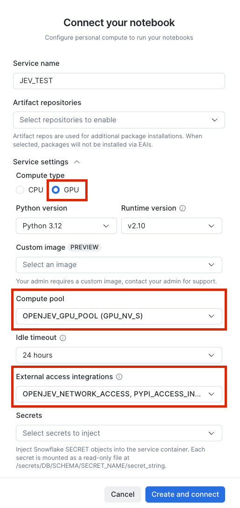

# SemIf-OpenJev Decision Model on Snowflake

**Deploy a semantic inference scoring model as a real-time GPU inference service using Snowflake Model Registry and SPCS.**

---

## 📋 Overview

This notebook demonstrates end-to-end deployment of [SemIf-OpenJev](https://github.com/TheoLeeCJ/SemIf-OpenJev) — a semantic inference scoring model using **Qwen/Qwen3.5-4B (frozen)** — as a real-time inference service via Snowflake Model Registry.

**How it works:** Given a text `state`, a `question`, and 2–16 `options`, SemIf returns a probability for each option in a single forward pass. No text generation, no classification head — just probability scoring.

---

## 🚀 Quick Start

### Prerequisites
- **Roles:** SYSADMIN (most operations) + ACCOUNTADMIN (external access integration only)
- **GPU compute pool:** GPU_NV_S (single A10G, 22 GB VRAM) — model runs at bf16
- **Notebook service:** Must have external access to PyPI + HuggingFace + GitHub
- **Time:** ~15–25 min for setup + **30–60 min** for first SPCS image build
- **Cost:** GPU_NV_S compute pool runs ~$3–4/hour when active (auto-suspends after 10 min idle)
- **No API keys needed** — Uses public GitHub repo (MIT license) and public HuggingFace model

### Notebook Service Configuration

**Before running the notebook, configure your notebook service:**



**Required settings:**
1. **Compute pool:** `OPENJEV_GPU_POOL` (GPU_NV_S)
2. **External access integrations:**
   - `PYPI_ACCESS_INTEGRATION` (for pip installs)
   - `OPENJEV_NETWORK_ACCESS` (for GitHub and HuggingFace access)

---

## 📦 What's Included

- **`jev_demo_100226.ipynb`** - Complete end-to-end deployment notebook with:
  - Infrastructure setup (database, schema, compute pool, network rules)
  - Model download and logging to registry
  - SPCS service deployment
  - Testing examples with restaurant review sentiment analysis
  - Cleanup commands

---

## ⚙️ Architecture

```
┌─────────────────────────────────────────────────────────────┐
│ Snowflake Notebook (GPU service)                            │
│  • Downloads SemIf source from GitHub                       │
│  • Downloads Qwen3.5-4B weights from HuggingFace (~9.3 GB)  │
│  • Logs custom model to Model Registry                      │
└─────────────────────────────────────────────────────────────┘
                           │
                           ▼
┌─────────────────────────────────────────────────────────────┐
│ Model Registry (JEV_DEMO.INFERENCE.OPENJEV)                 │
│  • Bundles model + weights + dependencies                   │
│  • Auto-builds container image                              │
└─────────────────────────────────────────────────────────────┘
                           │
                           ▼
┌─────────────────────────────────────────────────────────────┐
│ SPCS Inference Service (OPENJEV_SVC)                        │
│  • Runs on GPU_NV_S compute pool (A10G)                     │
│  • Exposes !PREDICT service function                        │
│  • Auto-suspends after 10 min idle                          │
└─────────────────────────────────────────────────────────────┘
```

---

## 📝 Usage Example

Once deployed, call the service function from SQL:

```sql
-- Single prediction
SELECT JEV_DEMO.INFERENCE.OPENJEV_SVC!PREDICT(
    'r1',
    'The waiter forgot our order twice and the pasta was cold.',
    'Was this a good or bad restaurant experience?',
    '[{"id":"good","description":"Good experience"},{"id":"bad","description":"Bad experience"}]'
) AS result;
```

**Output:**
```json
{
  "id": "r1",
  "choice": "bad",
  "options_json": "[{\"id\":\"good\",\"probability\":0.001},{\"id\":\"bad\",\"probability\":0.999}]"
}
```

---

## 🔒 Security Notes

- **Network access:** External access integration allows egress to PyPI, GitHub, and HuggingFace domains (with wildcards for CDN subdomains). Review these against your organization's security policies.
- **No credentials required:** This demo uses only public resources (MIT-licensed repo, public model).
- **Role requirements:** ACCOUNTADMIN needed only for creating the external access integration; all other operations use SYSADMIN.

---

## 💰 Cost Considerations

- **GPU Compute Pool (GPU_NV_S):** ~$3–4/hour when running
  - Auto-suspends after 10 minutes of inactivity
  - Auto-resumes on first query
- **Model Storage:** ~9.3 GB in Model Registry (stage storage costs)
- **Image Storage:** ~10–15 GB in image repository

**Recommendation:** Run in a development/test account first to understand costs for your use case.

---

## 🛠️ Customization

This notebook uses example resource names. Customize these for your environment:

| Resource | Example Name | Customize To |
|----------|-------------|--------------|
| Database | `JEV_DEMO` | Your database name |
| Schema | `INFERENCE` | Your schema name |
| Warehouse | `OPENJEV_WH` | Your warehouse name |
| Compute Pool | `OPENJEV_GPU_POOL` | Your pool name |
| Service | `OPENJEV_SVC` | Your service name |

**Find and replace these names throughout the notebook before running.**

---

## 🧹 Cleanup

To remove all resources created by this demo:

```sql
DROP SERVICE IF EXISTS JEV_DEMO.INFERENCE.OPENJEV_SVC;
DROP MODEL IF EXISTS JEV_DEMO.INFERENCE.OPENJEV;
ALTER COMPUTE POOL OPENJEV_GPU_POOL STOP ALL;
DROP COMPUTE POOL IF EXISTS OPENJEV_GPU_POOL;
DROP WAREHOUSE IF EXISTS OPENJEV_WH;
DROP DATABASE IF EXISTS JEV_DEMO;
```

---

## 📚 References

- [SemIf-OpenJev GitHub Repository](https://github.com/TheoLeeCJ/SemIf-OpenJev) (MIT License)
- [Qwen3.5-4B Model](https://huggingface.co/Qwen/Qwen3.5-4B) (Apache 2.0 License)
- [Snowflake Model Registry Documentation](https://docs.snowflake.com/en/developer-guide/snowpark-ml/model-registry/overview)
- [Snowflake SPCS Documentation](https://docs.snowflake.com/en/developer-guide/snowpark-container-services/overview)

---

## 📄 License

This tutorial is licensed under the **MIT License**. See the [LICENSE](LICENSE) file for details.

**Third-party components used in this tutorial:**
- **SemIf-OpenJev:** MIT License
- **Qwen/Qwen3.5-4B:** Apache License 2.0

Users must comply with the licenses of these dependencies when using this tutorial.

---

## ⚠️ Disclaimer

**This is a reference implementation for demonstration purposes.** 

Before using in production:
- Test thoroughly in a development environment
- Review security settings and network access rules
- Add appropriate error handling and monitoring
- Customize resource names and configurations
- Understand cost implications for your workload
- Review external dependencies (GitHub, HuggingFace availability)

---

## 🤝 Support

For issues with:
- **Snowflake features:** Contact Snowflake Support
- **SemIf model:** See [SemIf-OpenJev GitHub Issues](https://github.com/TheoLeeCJ/SemIf-OpenJev/issues)
- **This demo:** Review the notebook comments and expected results section

---

**Last Updated:** October 5, 2026
